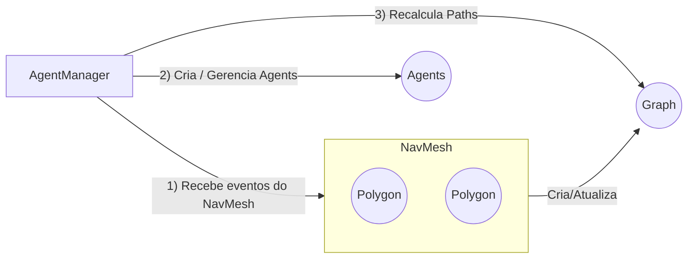

# **Guia Específico: AgentManager e AgentProfile**

Este guia se aprofunda na parte da biblioteca que gerencia **múltiplos agentes** e seus respectivos perfis de navegação. Aqui, aprenderemos a:

1. **Entender a proposta do AgentManager**  
2. **Criar e registrar perfis de agentes (AgentProfile)**  
3. **Criar, configurar e atualizar agentes**  
4. **Recalcular caminhos quando o grafo é atualizado**  
5. **Utilizar eventos específicos do AgentManager**  

---

## **Visão Geral**

O **AgentManager** coordena o comportamento de vários agentes (entidades que se movimentam no mapa) em conjunto com a **NavMesh** e o **Pathfinder**. A classe oferece:

- **Registro de perfis** (AgentProfile), que definem características como camadas permitidas, raio do agente, custos de terreno, etc.
- **Criação de agentes** associados a esses perfis.
- **Atualização de posições**, **recalcular caminhos** quando o grafo é alterado ou quando o destino muda.
- **Escuta de eventos do NavMesh** para reagir dinamicamente (por exemplo, quando um obstáculo bloqueia o caminho).

### **AgentProfile**

Um **AgentProfile** descreve as restrições de um tipo de agente. Por exemplo:  
- **`minPathWidth`**: largura mínima para passagem (ou seja, se o polígono é muito estreito, o agente não pode passar).  
- **`allowedLayers`**: conjunto de camadas que o agente pode atravessar.  
- **`terrainCosts`**: custo adicional para atravessar certas camadas (como lama, água, lava etc.).  

Isso permite que agentes com perfis diferentes tenham comportamentos diferenciados num mesmo cenário (ex.: um carro, um pedestre, um robô).

---

## **Arquitetura Básica**



1. **NavMesh** gerencia polígonos e gera um **Graph**.  
2. **AgentManager** escuta eventos **`graphupdated`** do NavMesh para:  
   - limpar cache,  
   - recalcular o caminho de cada agente ativo.  
3. **AgentManager** usa o **Pathfinder** para encontrar o **caminho** correto, levando em conta o **AgentProfile**.  

---

## **Passo a Passo de Uso**

### 1. **Registrar Perfis de Agentes**

Antes de criar qualquer agente, defina e registre os perfis:

```js
import { AgentManager, AgentProfile } from "./AgentManager.js";

// Supondo que você já tenha um navMesh criado
const agentManager = new AgentManager(navMesh);

// Cria um perfil para um "humano" com certas restrições
const humanProfile = new AgentProfile({
  radius: 0.5,
  minPathWidth: 1.0,
  maxSlope: 30,
  allowedLayers: new Set(["default", "cidade"]),
  terrainCosts: {
    default: 1,
    cidade: 1,
    lama: 2, // custo maior para lama
  },
});

// Registra o perfil sob o nome "human"
agentManager.registerProfile("human", humanProfile);
```

Algumas validações internas são feitas, como:
- `minPathWidth >= 2 * radius`  
- `maxSlope` deve estar entre 0 e 90 graus  

### 2. **Criar um Agente**

Após registrar um perfil, podemos criar o agente real:

```js
// ID único, nome do perfil e posição inicial
const agent = agentManager.createAgent("agent1", "human", { x: 50, y: 50 });
```

O `agent` criado conterá:
- `id`: `"agent1"`.
- `profile`: referência ao `AgentProfile`.
- `position`: `{ x: 50, y: 50 }`.
- `currentPath`: array de pontos do caminho.
- `target`: destino (pode ser `null` inicialmente).
- `graph`: grafo filtrado (no qual só entram camadas permitidas e custos adequados).

### 3. **Definir um Destino**

Para que o agente se mova, defina um **target**:

```js
agentManager.setAgentTarget("agent1", { x: 200, y: 120 });
```

Internamente, o AgentManager chamará `recalculateAgentPath`, que usará o **Pathfinder** para encontrar o caminho mais apropriado no grafo filtrado para esse agente.

### 4. **Atualizar a Posição do Agente**

Em cada frame (ou loop de jogo), podemos mover o agente ao longo do caminho calculado, usando:

```js
// Atualiza posição com step = 2
agentManager.updateAgent("agent1", 2);
```

Essa função move o agente em direção ao próximo ponto do caminho (`agent.currentPath[0]`). Quando esse ponto é alcançado (distância < `step`), ele é removido da lista, e o agente passa a se dirigir ao próximo ponto.

### 5. **Restrições e Custos de Terreno**

No método interno `_getAgentGraph`, o AgentManager:
1. Filtra nós do grafo original que estão **acessíveis** ao agente (checando, por exemplo, `allowedLayers`).  
2. Ajusta o `peso` de cada aresta conforme `terrainCosts`.  

Assim, **caminhos em camadas com custo alto** serão evitados pelo pathfinding — exceto se forem a única rota.

### 6. **Resposta a Mudanças no Grafo**

Quando o `NavMesh` emite **`graphupdated`** (por exemplo, ao adicionar ou remover um obstáculo), o AgentManager:

1. Limpa o cache de grafos.  
2. Para cada agente ativo que tenha um destino (`agent.target != null`), chama `recalculateAgentPath`.  

Isto garante que todo agente recalcula seu caminho imediatamente ao detetar que a navegação mudou.

---

## **Eventos Importantes**

A classe `AgentManager` **estende** `EventEmitter`, então dispara eventos:

1. **`agentCreated`**  
   - Quando `createAgent` é chamado.  
   - Retorna o objeto do agente criado.

2. **`agentPathUpdated`**  
   - Quando um caminho é recalculado com `recalculateAgentPath`.  
   - Retorna `{ agentId, path, partial }`.

3. **`agentUpdated`**  
   - Quando `updateAgent` é chamado.  
   - Retorna `{ agentId, position, remainingPath }`.

Também **escuta** o evento `graphupdated` do `NavMesh`.

---

## **API em Destaque**

### **AgentManager**

| Método                                         | Descrição                                                                                   |
|------------------------------------------------|---------------------------------------------------------------------------------------------|
| **constructor(navMesh)**                       | Cria o manager vinculado a um `NavMesh`.                                                   |
| **registerProfile(profileName, AgentProfile)** | Registra um perfil de agente com nome único.                                               |
| **createAgent(agentId, profileName, pos)**     | Cria um agente em `pos` com o perfil indicado.                                             |
| **setAgentTarget(agentId, target, partial?)**  | Define o destino do agente e recalcula o caminho.                                          |
| **recalculateAgentPath(agentId, partial?)**    | Força o recálculo do caminho para o agente (caso ele tenha alvo).                          |
| **updateAgent(agentId, step?)**                | Move o agente em direção ao próximo ponto do caminho; dispara `agentUpdated`.              |
| **getAgent(agentId)**                          | Retorna o objeto de agente pelo ID.                                                        |

#### Métodos e detalhes internos

- **`_getAgentGraph(profile)`**:  
  Cria um **grafo filtrado** com base no perfil do agente (allowedLayers, terrainCosts etc.).  
- **`_isNodeAccessible(node, profile)`**:  
  Verifica se o polígono do nó possui a camada correta para este agente.  
- **`_isEdgeTraversable(edge, profile)`**:  
  Método simplificado que pode ser customizado para verificar dimensões, rampas etc.

### **AgentProfile**

| Propriedade      | Descrição                                                                                     |
|------------------|-------------------------------------------------------------------------------------------------|
| **`radius`**     | Raio (tamanho) do agente.                                                                       |
| **`minPathWidth`** | Largura mínima de corredor.                                                                   |
| **`maxSlope`**   | Inclinação máxima em graus que o agente consegue atravessar.                                    |
| **`allowedLayers`** | Conjunto de camadas autorizadas.                                                             |
| **`stepHeight`** | Altura máxima de degrau que consegue superar (0.5 por exemplo).                                  |
| **`jumpHeight`** | Altura de salto máxima (usado em cenários com saltos ou degraus grandes).                        |
| **`terrainCosts`** | Objeto mapeando `{ [layerName]: cost }`.                                                      |

---

## **Exemplo: Juntando Tudo**

```js
// Exemplo hipotético

// 1. Criar NavMesh e AgentManager
const navMesh = new NavMesh();
const agentManager = new AgentManager(navMesh);

// 2. Registrar perfil "soldier"
const soldierProfile = new AgentProfile({
  radius: 1,
  minPathWidth: 2,
  maxSlope: 45,
  allowedLayers: new Set(["default", "road"]),
  terrainCosts: { default: 1, road: 0.5, sand: 2 },
});
agentManager.registerProfile("soldier", soldierProfile);

// 3. Criar agent
agentManager.createAgent("agent_s1", "soldier", { x: 10, y: 10 });

// 4. Definir destino
agentManager.setAgentTarget("agent_s1", { x: 200, y: 150 });

// 5. No loop de atualização do jogo:
function gameLoop() {
  // - mover agente
  agentManager.updateAgent("agent_s1", 3); // step = 3
  // - renderização etc.
  requestAnimationFrame(gameLoop);
}
gameLoop();

// 6. Se um obstáculo dinâmico for adicionado em runtime...
navMesh.dynamicObstacleManager.addObstacle(...);
// --> NavMesh emite "graphupdated" --> AgentManager escuta e recalcula caminho do agente
```

---

## **Boas Práticas**

1. **Reaproveitar ou ignorar cache**: O código fornece `cachedGraphs`, mas no exemplo atual está limpando ao menor sinal de mudança (você pode otimizar).  
2. **Dimensionar step**: Ajuste o `step` em `updateAgent` conforme a velocidade do agente.  
3. **Nomes de perfil**: Use nomes autoexplicativos (`worker`, `zombie`, `drone`) para facilitar.  
4. **Validar camadas**: As camadas que o agente pode acessar (allowedLayers) devem existir no seu `NavMesh.layerSystem`.  
5. **Escuta de eventos**: Os eventos `agentPathUpdated` e `agentUpdated` permitem integrar o sistema com rotinas de animação, exibição de UI, etc.

---

## **Conclusão**

Com o **AgentManager**, você pode facilmente:
- Criar perfis distintos,
- Gerenciar múltiplos agentes simultâneos,
- Recalcular seus caminhos automaticamente frente a mudanças no mapa.

A combinação de **AgentManager**, **Pathfinder** e **NavMesh** garante um ecossistema flexível, expansível e pronto para lidar com casos complexos de navegação e movimentação em um cenário 2D.

Boa implementação!